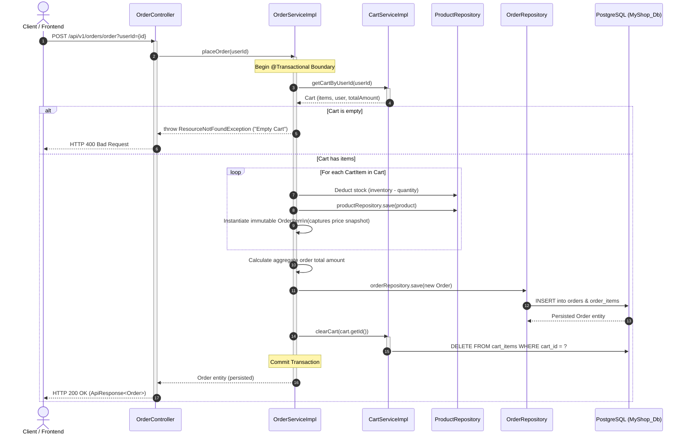
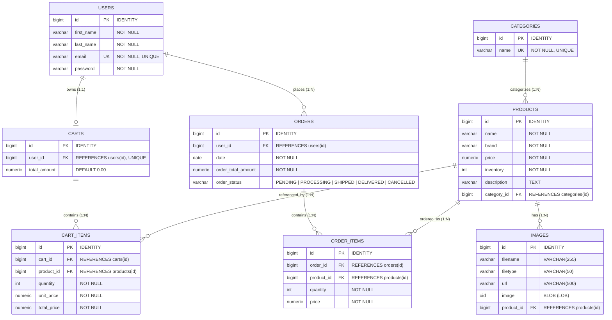

# E-Commerce Backend Platform

[](https://www.oracle.com/java/)
[](https://spring.io/projects/spring-boot)
[](https://www.postgresql.org/)
[](http://localhost:9090/swagger-ui.html)
[](https://maven.apache.org/)

A robust, enterprise-ready RESTful e-commerce backend built with **Spring Boot** and **PostgreSQL**. Designed with clean layered architecture, defensive domain modeling, transactional checkout flows, and decoupled Data Transfer Objects (DTOs) to eliminate circular serialization issues.

---

## Table of Contents
- [Features](#features)
- [Architecture](#architecture)
  - [System Component Diagram](#system-component-diagram)
  - [Order Checkout Transaction Flow](#order-checkout-transaction-flow)
  - [Architectural Highlights](#architectural-highlights)
- [Tech Stack](#tech-stack)
- [Database Schema & Relationships](#database-schema--relationships)
  - [Entity Relationship Diagram (ERD)](#entity-relationship-diagram-erd)
  - [Association & Integrity Rules](#association--integrity-rules)
- [API Endpoints](#api-endpoints)
- [Project Structure](#project-structure)
- [How to Run](#how-to-run)
- [Example Requests](#example-requests)
- [Future Improvements](#future-improvements)

---

## Features

- **Product & Catalog Management**: Multi-criteria querying (filter by brand, category, name, or combined parameters) with real-time inventory count tracking.
- **Shopping Cart Engine**: Stateful session carts with automatic total amount aggregation, quantity recalculation, and orphan item cleanup.
- **Transactional Order Processing**: Atomic `@Transactional` checkout that converts active cart items into permanent order items, deducts inventory, clears the cart, and creates an immutable invoice.
- **Media & Binary Storage**: Multi-file multipart image upload with relational database BLOB persistence, automated metadata extraction, and streaming download endpoints.
- **DTO Projection Layer**: Utilizes `ModelMapper` and dedicated response DTOs (`ProductDto`, `ImageDto`, `UserDto`) to prevent recursive JSON serialization and decouple domain models from client contracts.
- **Standardized API Response Envelope**: Consistent `ApiResponse<T>` payload format across all endpoints with explicit HTTP status handling.
- **Global Error Handling**: Custom exception hierarchy (`ResourceNotFoundException`, `AlreadyExistsException`, `ProductNotFoundException`) ensuring clean client-facing error payloads.
- **Interactive API Documentation**: Live interactive OpenAPI 3 / Swagger documentation UI.

---

## Architecture

### System Component Diagram

The backend is structured according to a **Decoupled Layered Domain-Driven Architecture**:

```mermaid
flowchart TD
    subgraph Clients["Client Layer"]
        Browser["Web / Mobile Frontend"]
        Postman["API Clients / Postman"]
        Swagger["OpenAPI 3 / Swagger UI"]
    end

    subgraph SpringBoot["Spring Boot Application Layer (Embedded Tomcat : 9090)"]
        subgraph WebLayer["Presentation & Controller Layer (/api/v1)"]
            PC["ProductController"]
            CC["CategoryController"]
            OC["OrderController"]
            CartC["CartController & CartItemController"]
            UC["UserController"]
            IC["ImageController"]
        end

        subgraph CrossCutting["Cross-Cutting & Transformation Layer"]
            RespEnvelope["Universal Response Envelope\n(ApiResponse<T>)"]
            ExHandler["Global Exception Handling\n(ResourceNotFound, AlreadyExists)"]
            Mapper["Object Mapping Layer\n(ModelMapper, DTO Transformers)"]
        end

        subgraph ServiceLayer["Service & Business Logic Layer (@Transactional)"]
            PS["ProductServiceImpl"]
            CS["CategoryServiceImpl"]
            OS["OrderServiceImpl"]
            CartS["CartServiceImpl & CartItemServiceImpl"]
            US["UserServiceImpl"]
            IS["ImageServiceImpl"]
        end

        subgraph DataLayer["Data Access Layer (Spring Data JPA)"]
            PRepo["ProductRepository"]
            CRepo["CategoryRepository"]
            ORepo["OrderRepository"]
            CartRepo["CartRepository & CartItemRepository"]
            URepo["UserRepository"]
            IRepo["ImageRepository"]
        end
    end

    subgraph Persistence["Persistence & Database Layer"]
        subgraph Postgres["PostgreSQL Database (MyShop_Db)"]
            Tables["Relational Tables\n(users, orders, order_items, carts, cart_items, product, category)"]
            BLOBs["Binary Large Objects (LOB)\n(Product Media & Images)"]
        end
    end

    Clients -->|HTTP / REST (JSON & Multipart)| WebLayer
    WebLayer --> RespEnvelope
    WebLayer --> ExHandler
    WebLayer -->|DTO Requests| ServiceLayer
    ServiceLayer <-->|Entity ↔ DTO| Mapper
    ServiceLayer -->|Domain Repositories| DataLayer
    DataLayer -->|Hibernate ORM / SQL| Postgres
    Postgres -->|Result Sets / Entities| DataLayer
    DataLayer -->|Entities| ServiceLayer
    ServiceLayer -->|Mapped DTOs| WebLayer
    RespEnvelope -->|JSON Response| Clients
```

---

### Order Checkout Transaction Flow

The sequence below illustrates the atomic multi-table checkout process executed inside a single `@Transactional` boundary in `OrderServiceImpl`:



---

### Architectural Highlights
- **Decoupled Contracts**: Domain entities (`Product`, `Cart`, `User`) are never leaked directly across public endpoints; responses are mapped to dedicated DTOs to avoid circular reference loops and over-fetching.
- **Atomic Operations**: Critical multi-table workflows (such as placing an order, deducting stock, and clearing carts) are wrapped inside `@Transactional` boundaries to guarantee ACID compliance.
- **Defensive Modeling**: Business logic such as calculating cart totals and updating item sub-totals is encapsulated within domain models (`Cart.updateTotalAmount()`).

---

## Tech Stack

| Component | Technology | Purpose / Justification |
| :--- | :--- | :--- |
| **Language** | Java 17 (LTS) | Modern Java features, records, streams, enhanced pattern matching |
| **Framework** | Spring Boot 4.1.1 | Rapid application bootstrap, IoC container, and enterprise features |
| **Persistence** | Spring Data JPA / Hibernate | Object-Relational Mapping (ORM) and declarative repository queries |
| **Database** | PostgreSQL | Robust ACID-compliant relational persistence |
| **API Documentation** | SpringDoc OpenAPI 3 (Swagger UI) | Automated, interactive REST API testing interface |
| **Object Mapping** | ModelMapper 3.2.4 | Automated, clean mapping between JPA entities and DTOs |
| **Boilerplate Reduction** | Project Lombok | Clean models with auto-generated getters, setters, and constructors |
| **Build Tool** | Apache Maven | Deterministic build lifecycle and dependency management |

---

## Database Schema & Relationships

### Entity Relationship Diagram (ERD)

The diagram below highlights primary keys (`PK`), foreign keys (`FK`), unique constraints (`UK`), and relational cardinalities across all 8 domain tables:



---

### Association & Integrity Rules

| Parent Entity | Child Entity | Cardinality | Join Column | JPA Annotation & Cascade Policy | Lifecycle & Integrity Rules |
| :--- | :--- | :---: | :--- | :--- | :--- |
| **`User`** | **`Cart`** | `1 : 1` | `user_id` | `@OneToOne(cascade = ALL, orphanRemoval = true)` | Each user owns exactly one cart; deleting a user purges their active cart. |
| **`User`** | **`Order`** | `1 : N` | `user_id` | `@OneToMany(cascade = ALL, orphanRemoval = true)` | A user can place multiple orders over time; historical orders belong to that user. |
| **`Category`** | **`Product`** | `1 : N` | `category_id` | `@OneToMany` / `@ManyToOne` | Products belong to a single category; category deletion does not purge catalog products. |
| **`Product`** | **`Image`** | `1 : N` | `product_id` | `@OneToMany(cascade = ALL, orphanRemoval = true)` | Products can have multiple gallery images; deleting a product cascades to delete its media BLOBs. |
| **`Cart`** | **`CartItem`** | `1 : N` | `cart_id` | `@OneToMany(cascade = ALL, orphanRemoval = true)` | Items inside a cart are owned by the cart; clearing a cart deletes all its line items. |
| **`Order`** | **`OrderItem`** | `1 : N` | `order_id` | `@OneToMany(cascade = ALL, orphanRemoval = true)` | Orders own immutable order item snapshots reflecting unit price at purchase time. |
| **`Product`** | **`CartItem`** | `1 : N` | `product_id` | `@ManyToOne` | Cart items point to catalog products for pricing & title resolution. |
| **`Product`** | **`OrderItem`** | `1 : N` | `product_id` | `@ManyToOne` | Order items point to products for fulfillment tracking. |

---

## API Endpoints

Base URL Prefix: `/api/v1`

### 1. Product Catalog (`/api/v1/products`)
| Method | Endpoint | Description |
| :--- | :--- | :--- |
| `GET` | `/products/all` | Retrieve all products (mapped to `ProductDto`) |
| `GET` | `/products/product/{productId}` | Retrieve specific product details by ID |
| `GET` | `/products/by/name/{name}` | Find products by exact or matching name |
| `GET` | `/products/by/brand?brand={name}` | Find products by brand |
| `GET` | `/products/by/category/{category}` | Find products by category name |
| `GET` | `/products/by/category-and-brand?category={c}&brand={b}` | Filter products by both category and brand |
| `GET` | `/products/by/brand-and-name?brand={b}&name={n}` | Filter products by brand and name |
| `GET` | `/products/count/by-brand/and-name?brand={b}&name={n}` | Get aggregate count of products matching brand and name |
| `POST` | `/products/add` | Add a new product to catalog |
| `PUT` | `/products/product/{productId}/update` | Update existing product details |
| `DELETE` | `/products/product/{productId}/delete` | Delete product and cascade remove related images |

### 2. Cart Operations (`/api/v1/carts`)
| Method | Endpoint | Description |
| :--- | :--- | :--- |
| `POST` | `/carts/initialize` | Initialize a new empty shopping cart |
| `GET` | `/carts/{cartId}` | Retrieve cart with all items and computed total |
| `GET` | `/carts/user/{userId}` | Retrieve active cart for a specific user |
| `GET` | `/carts/{cartId}/total-price` | Get computed total monetary amount for cart |
| `DELETE` | `/carts/{cartId}/clear` | Purge all items from cart |

### 3. Cart Items (`/api/v1/cartItems`)
| Method | Endpoint | Description |
| :--- | :--- | :--- |
| `POST` | `/cartItems/item/add?cartId={c}&productId={p}&quantity={q}` | Add item or increment quantity in cart |
| `PUT` | `/cartItems/{cartId}/item/{productId}/quantity/{q}/update` | Update specific item quantity |
| `DELETE` | `/cartItems/{cartId}/item/{productId}/remove` | Remove specific product from cart |

### 4. Order Management (`/api/v1/orders`)
| Method | Endpoint | Description |
| :--- | :--- | :--- |
| `POST` | `/orders/order?userId={userId}` | Convert active user cart to an order & deduct inventory |
| `GET` | `/orders/{orderId}` | Fetch order details, status, and line items |

### 5. Category Management (`/api/v1/categories`)
| Method | Endpoint | Description |
| :--- | :--- | :--- |
| `GET` | `/categories/all` | List all available product categories |
| `GET` | `/categories/category/{id}` | Get category by ID |
| `GET` | `/categories/category/by-name/{name}` | Get category by name |
| `POST` | `/categories/add` | Create a new category |
| `PUT` | `/categories/category/{id}/update` | Update category name |
| `DELETE` | `/categories/category/{id}/delete` | Delete category |

### 6. Media & Image Uploads (`/api/v1/images`)
| Method | Endpoint | Description |
| :--- | :--- | :--- |
| `POST` | `/images/upload` | Upload multiple images for a product (`multipart/form-data`) |
| `GET` | `/images/image/download/{imageId}` | Stream and download raw binary image file |
| `PUT` | `/images/image/{imageId}/update` | Replace binary content of existing image |
| `DELETE` | `/images/image/{imageId}/delete` | Remove an image record and binary data |

### 7. User Management (`/api/v1/users`)
| Method | Endpoint | Description |
| :--- | :--- | :--- |
| `POST` | `/users/add` | Register a new user |
| `GET` | `/users/{id}` | Retrieve user profile by ID |
| `PUT` | `/users/{id}/update` | Update user personal details |
| `DELETE` | `/users/{id}/delete` | Remove user account |

---

## Project Structure

```text
E-com/
├── src/
│   ├── main/
│   │   ├── java/com/ecom/
│   │   │   ├── config/            # Bean configurations (ModelMapper, OpenAPI)
│   │   │   ├── controller/        # REST Controllers (API endpoints)
│   │   │   ├── dto/               # Decoupled Data Transfer Objects (ProductDto, ImageDto, UserDto)
│   │   │   ├── enums/             # Domain enumerations (OrderStatus)
│   │   │   ├── exception/         # Domain-specific custom exceptions & handlers
│   │   │   ├── model/             # JPA Entity models & database mapping
│   │   │   ├── repository/        # Spring Data JPA repositories with custom derived queries
│   │   │   ├── request/           # Client request contracts & payloads
│   │   │   ├── response/          # Universal API response envelopes
│   │   │   └── service/           # Business logic interfaces & implementation classes
│   │   │       └── impl/
│   │   └── resources/
│   │       ├── application.properties # Server port, database credentials, multipart limits
│   │       └── templates/
│   └── test/                      # Unit and integration test suites
├── pom.xml                        # Maven dependencies & build configuration
└── README.md
```

---

## How to Run

### Prerequisites
- **Java Development Kit (JDK)**: Version 17 or higher
- **PostgreSQL**: Version 14 or higher running on port `5432`
- **Maven**: Version 3.8+ (or use the included `mvnw`)

### 1. Database Setup
Create a PostgreSQL database named `MyShop_Db`:
```sql
CREATE DATABASE "MyShop_Db";
```

### 2. Configure Credentials
Update `src/main/resources/application.properties` with your PostgreSQL credentials:
```properties
spring.datasource.url=jdbc:postgresql://localhost:5432/MyShop_Db
spring.datasource.username=postgres
spring.datasource.password=your_password
```

### 3. Build & Run
Open terminal in the project root:

**On Windows:**
```powershell
mvn clean install
mvn spring-boot:run
```

**On Linux / macOS:**
```bash
./mvnw clean install
./mvnw spring-boot:run
```

The application will start on **port `9090`**.

### 4. Interactive Swagger UI
Access the interactive OpenAPI Swagger documentation directly in your browser:
```text
http://localhost:9090/swagger-ui.html
```

---

## Example Requests

### 1. Create a New User
```bash
curl -X POST http://localhost:9090/api/v1/users/add \
  -H "Content-Type: application/json" \
  -d '{
    "firstName": "Alex",
    "lastName": "Johnson",
    "email": "alex.johnson@example.com",
    "password": "StrongPassword123!"
  }'
```

### 2. Add a Product
```bash
curl -X POST http://localhost:9090/api/v1/products/add \
  -H "Content-Type: application/json" \
  -d '{
    "name": "Wireless Noise Cancelling Headphones",
    "brand": "AudioTech",
    "price": 199.99,
    "inventory": 50,
    "description": "Premium over-ear headphones with 30-hour battery life",
    "category": {
      "name": "Electronics"
    }
  }'
```

### 3. Add Item to Cart
```bash
curl -X POST "http://localhost:9090/api/v1/cartItems/item/add?cartId=1&productId=1&quantity=2"
```

### 4. Place an Order (Checkout)
```bash
curl -X POST "http://localhost:9090/api/v1/orders/order?userId=1"
```

**Response (`200 OK`):**
```json
{
  "message": "Order Placed Successfully!",
  "data": {
    "id": 1,
    "date": "2026-09-23",
    "orderTotalAmount": 399.98,
    "orderStatus": "PENDING",
    "orderItems": [
      {
        "id": 1,
        "quantity": 2,
        "price": 199.99
      }
    ]
  }
}
```

---

## Future Improvements

- [ ] **Concurrency & Flash-Sale Protection**: Implement Optimistic Locking (`@Version`) and Pessimistic Locking (`SELECT FOR UPDATE`) on inventory to prevent overselling during high-concurrency checkouts.
- [ ] **Redis Caching Layer**: Implement the Cache-Aside pattern on product lookups and catalog queries to reduce PostgreSQL read latency.
- [ ] **Event-Driven Architecture**: Decouple post-checkout workflows (email confirmation, invoice generation, inventory sync) using Spring `@Async` events and **RabbitMQ / Apache Kafka**.
- [ ] **Real-Time Customer Support**: Bidirectional customer support chat and live order tracking via **Spring WebSockets & STOMP protocol**.
- [ ] **Third-Party Payment Gateway**: Integrate Stripe / Razorpay webhooks with cryptographic HMAC signature verification and idempotency keys.
- [ ] **Database Migration Versioning**: Migrate schema evolution from `hibernate.ddl-auto=update` to versioned **Flyway** migration scripts.
- [ ] **Containerization & Orchestration**: Containerize the Spring Boot application, PostgreSQL, and Redis cache via a multi-stage `Dockerfile` and `docker-compose.yml`.
