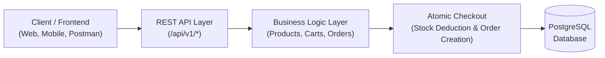

# E-Commerce Backend Platform

[](https://www.oracle.com/java/)
[](https://spring.io/projects/spring-boot)
[](https://www.postgresql.org/)
[](http://localhost:8080/swagger-ui.html)
[](https://maven.apache.org/)

A RESTful e-commerce backend platform built with **Spring Boot** and **PostgreSQL**, focusing on catalog management, shopping cart operations, transactional order processing, image persistence, and OpenAPI documentation.

---

## Workflow


```mermaid
flowchart LR
    Client["Client / Frontend\n(Web, Mobile, Postman)"]
    --> API["REST API Layer\n(/api/v1/*)"]
    --> Service["Business Logic Layer\n(Products, Carts, Orders)"]
    --> Checkout["Atomic Checkout\n(Stock Deduction & Order Creation)"]
    --> DB[("PostgreSQL\nDatabase")]
```

---

## Features

- **Product Catalog**: Multi-criteria querying (filter by brand, category, name, or combinations) and inventory tracking.
- **Shopping Cart**: Cart management with automated total aggregation, quantity updates, and orphan item cleanup.
- **Transactional Checkout**: Atomic `@Transactional` checkout that validates stock, creates order snapshots, deducts inventory, and clears the cart.
- **Media Storage**: Multipart image uploads with PostgreSQL binary persistence and download streaming.
- **DTO Projection Layer**: Decoupled domain models using `ModelMapper` and response DTOs (`ProductDto`, `ImageDto`, `UserDto`).
- **Standardized API Envelope**: Uniform `ApiResponse<T>` payload format across all endpoints.
- **Global Exception Handling**: Centralized exception handling (`ResourceNotFoundException`, `AlreadyExistsException`) with clean error payloads.
- **Interactive Documentation**: Swagger UI / OpenAPI 3 for exploring and testing endpoints.

---

## Tech Stack

| Component | Technology | Description |
| :--- | :--- | :--- |
| **Language** | Java 17 | Core language platform |
| **Framework** | Spring Boot 4.1.1 | Web MVC, Dependency Injection & Validation |
| **Security** | Spring Security | Authentication & security foundation |
| **Persistence** | Spring Data JPA / Hibernate | Object-Relational Mapping & repositories |
| **Database** | PostgreSQL | Relational database storage |
| **API Docs** | SpringDoc OpenAPI 3 (Swagger) | Interactive REST API testing interface |
| **Mapping** | ModelMapper 3.2.4 | Entity-to-DTO transformation |
| **Build Tool** | Apache Maven | Dependency and build lifecycle management |

---

## API Endpoints

Base URL: `/api/v1`

| Module | Method | Endpoint | Description |
| :--- | :--- | :--- | :--- |
| **Products** | `GET` | `/products/all` | List all products |
| | `GET` | `/products/product/{productId}` | Get product by ID |
| | `GET` | `/products/by/brand-and-name?brand={b}&name={n}` | Filter products by brand and name |
| | `GET` | `/products/by/category-and-brand?category={c}&brand={b}` | Filter products by category and brand |
| | `POST` | `/products/add` | Add a new product |
| | `PUT` | `/products/product/{productId}/update` | Update existing product |
| | `DELETE` | `/products/product/{productId}/delete` | Delete product and its images |
| **Cart** | `POST` | `/carts/initialize` | Initialize a new cart |
| | `GET` | `/carts/{cartId}` | Get cart details and total price |
| | `GET` | `/carts/user/{userId}` | Get cart for specific user |
| | `DELETE` | `/carts/{cartId}/clear` | Clear all items from cart |
| **Cart Items** | `POST` | `/cartItems/item/add?cartId={c}&productId={p}&quantity={q}` | Add item or increment quantity |
| | `PUT` | `/cartItems/{cartId}/item/{productId}/quantity/{q}/update` | Update item quantity |
| | `DELETE` | `/cartItems/{cartId}/item/{productId}/remove` | Remove item from cart |
| **Orders** | `POST` | `/orders/order?userId={userId}` | Checkout cart into an order |
| | `GET` | `/orders/{orderId}` | Get order details |
| **Categories** | `GET` | `/categories/all` | List all categories |
| | `POST` | `/categories/add` | Create a new category |
| | `PUT` | `/categories/category/{id}/update` | Update category name |
| | `DELETE` | `/categories/category/{id}/delete` | Delete category |
| **Images** | `POST` | `/images/upload` | Upload product images (`multipart/form-data`) |
| | `GET` | `/images/image/download/{imageId}` | Stream/download image binary |
| | `DELETE` | `/images/image/{imageId}/delete` | Delete image record and binary data |
| **Users** | `POST` | `/users/add` | Register new user |
| | `GET` | `/users/{id}` | Get user profile |
| | `PUT` | `/users/{id}/update` | Update user details |
| | `DELETE` | `/users/{id}/delete` | Delete user account |

---

## Project Structure

```text
src/main/java/com/ecom/
├── config/         # Configurations (ModelMapper, OpenAPI)
├── controller/     # REST Controllers (/api/v1)
├── dto/            # Data Transfer Objects
├── enums/          # Enumerations (OrderStatus)
├── exception/      # Custom exceptions and global handlers
├── model/          # JPA Entity models
├── repository/     # Spring Data JPA repositories
├── request/        # Request payload contracts
├── response/       # Standardized ApiResponse envelope
└── service/        # Business logic interfaces and implementations
```

---

## Getting Started

### Prerequisites
- **JDK 17** or higher
- **PostgreSQL 14+**
- **Maven 3.8+** (or use included `mvnw`)

### 1. Database Setup
Create the PostgreSQL database:
```sql
CREATE DATABASE "MyShop_Db";
```

### 2. Configure Credentials
Update `src/main/resources/application-local.properties` (or `application.properties`):
```properties
spring.datasource.url=jdbc:postgresql://localhost:5432/MyShop_Db
spring.datasource.username=postgres
spring.datasource.password=your_password
```

### 3. Run the Application
```bash
./mvnw spring-boot:run
```
*(On Windows: `mvn spring-boot:run`)*

The server starts at `http://localhost:8080`.

### 4. Interactive Swagger Documentation
Open your browser and navigate to:
```text
http://localhost:8080/swagger-ui.html
```
